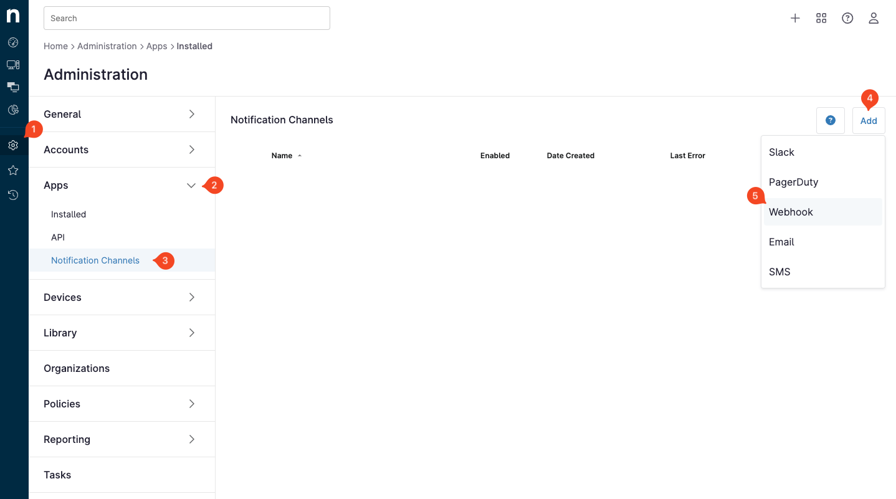
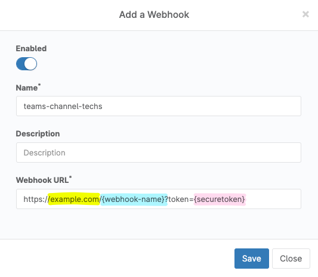

**Table of content:**

- [Description](#description)
- [Configuration](#configuration)
  - [Example with secure token](#example-with-secure-token)
  - [Example without secure token](#example-without-secure-token)
  - [Configuration for NinjaOne](#configuration-for-ninjaone)
  - [Overwrite HTML template](#overwrite-html-template)
- [Deployment](#deployment)
  - [Standalone](#standalone)
  - [Docker](#docker)
- [Development](#development)

# Description

This program created in Go aims to implement Microsoft Teams webhooks in [NinjaOne](https://www.ninjaone.com) notification channels.

We highly recommand to host it behind a reverse proxy like [Nginx](https://www.nginx.com/) or [Traefik](https://traefik.io/) and securing it with `SECURE_TOKEN` variable. The soft only listen on `POST` method.

It use [Go templates](https://golang.org/pkg/html/template/) to generate the HTML message sent to Teams, [Echo](https://echo.labstack.com/) as web framework and [Charmbracelet Log](https://github.com/charmbracelet/log) as logger. Thanks to them for their works.

# Configuration

This project configuration is done via environment variables and must be publicly accessible. For that you can use Reverse Proxy like [Nginx](https://www.nginx.com/) or [Traefik](https://traefik.io/).

| Variable name           | Description                                    | Default value    |
| ----------------------- | ---------------------------------------------- | ---------------- |
| `LOG_LEVEL`             | Levels of logs (debug, info, warn or error)    | `INFO`           |
| `LISTEN_PORT`           | Port to listen on                              | `3000`           |
| `TEMPLATES_DIRECTORY`   | Path of directory containing Go HTML templates | `/app/templates` |
| `SECURE_TOKEN`          | Secure token of your choice                    |                  |
| `WEBHOOK_{CUSTOM-NAME}` | Teams webhook url                              |                  |

`SECURE_TOKEN` is not mandatory. **If you not secure it, keep in mind that some bot over internet can call your webhook and send message in your teams channel.**

You can specify multiple teams webhook url with different names. For example, if you want to send notifications to two different teams channels, you can specify two different webhooks url or more.

> The `CUSTOM-NAME` is case **insensitive**.
> So `WEBHOOK_TEAM1` and `WEBHOOK_Team1` are the same and will be called with the same url `http://localhost:3000/team1`

## Example with secure token

```bash
SECURE_TOKEN=myTestToken
WEBHOOK_TEAM1=https://outlook.office.com/webhook/...
WEBHOOK_TEAM2=https://outlook.office.com/webhook/...
```

For each webhook url declared, it can be call by NinjaOne with the following url :

```bash
http://localhost:3000/team1?token=myTestToken
http://localhost:3000/team2?token=myTestToken
```

## Example without secure token

```bash
WEBHOOK_TEAM1=https://outlook.office.com/webhook/...
WEBHOOK_TEAM2=https://outlook.office.com/webhook/...
```

For each webhook url declared, you can call it with the following url :

```bash
http://localhost:3000/team1
http://localhost:3000/team2
```

## Configuration for NinjaOne

In NinjaOne, you can configure a new notification channel with the following configuration :



Then specify the url of your webhook :



Take care to replace `example.com` by your domain name,`{webhook-name}` by the name of your webhook and `{securetoken}` by your.

You can declare multiple webhooks for each teams channel you want to send notifications and name it as you want.

## Overwrite HTML template

The default template can be found in [templates/default.html](https://github.com/provectio/ninjaone-teamswebhook/blob/main/templates/default.html). You can overwrite it by mounting a volume containing your own template.

Note that all the data sent by NinjaOne are available in the template via the `data` variable.

```go
type RequestBody struct {
	ID             int     `json:"id"`
	ActivityTime   float64 `json:"activityTime"`
	ActivityType   string  `json:"activityType"`
	StatusCode     string  `json:"statusCode"`
	Status         string  `json:"status"`
	ActivityResult string  `json:"activityResult"`
	UserID         int     `json:"userId"`
	Message        string  `json:"message"`
	Type           string  `json:"type"`
	Data           `json:"data"`
}

type Data struct {
	Message struct {
		Code   string `json:"code"`
		Params struct {
			ClientID     string `json:"clientId"`
			ClientName   string `json:"clientName"`
			AppUserName  string `json:"appUserName"`
			AppUserID    string `json:"appUserId"`
			AppUserEmail string `json:"appUserEmail"`
		} `json:"params"`
	} `json:"message"`
}

```

# Deployment

## Standalone

You can download the binary for your architecture in the [release page](https://github.com/provectio/ninjaone-teamswebhook/releases).

Environment variables can be read via the `.env` file placed next to the execution file. Don't forger to create the templates directory and place your own template in it.

Folder structure example:

```bash
├── .env
├── ninjaone-teamswebhook(.exe)
└── templates
    └── default.html
```

## Docker

You have an example of deployment with docker-compose in the [docker-compose.yml](https://github.com/provectio/ninjaone-teamswebhook/blob/main/docker-compose.yml) file.

Else you can use the following command :

```bash
docker run -d \
  --name ninjaone-teamswebhook \
  -p 3000:3000 \
  -v /path/to/templates:/app/templates \
  -e SECURE_TOKEN=YourSecretToken007 \
  -e WEBHOOK_TEAM1=https://outlook.office.com/webhook/... \
  -e WEBHOOK_TEAM2=https://outlook.office.com/webhook/... \
  ghcr.io/provectio/ninjaone-teamswebhook:latest
```

# Development

In VSCode, you can use the [prettier](https://marketplace.visualstudio.com/items?itemName=esbenp.prettier-vscode) extension to format the code. Then install the plugins with `npm i`.

Create a `.env` file with the following content :

```bash
LOG_LEVEL=debug
SECURE_TOKEN=myTestToken
WEBHOOK_TEAM1=https://outlook.office.com/webhook/...
```

Then run the program with `go run .` or `go build && ./main`.

In Debug mode the full payload received will be printed in the console.

You can use `{{ expand . }}` in your template to print the full parsed payload received.

To take it publiclly accessible, you can use [ngrok](https://ngrok.com/) or the open soruce alternative (build in go) [pgrok](https://github.com/pgrok/pgrok) for example.

> Feel free to contribute to this project by completing the [request payload](https://github.com/provectio/ninjaone-teamswebhook/blob/main/types.go) or adding new features.
